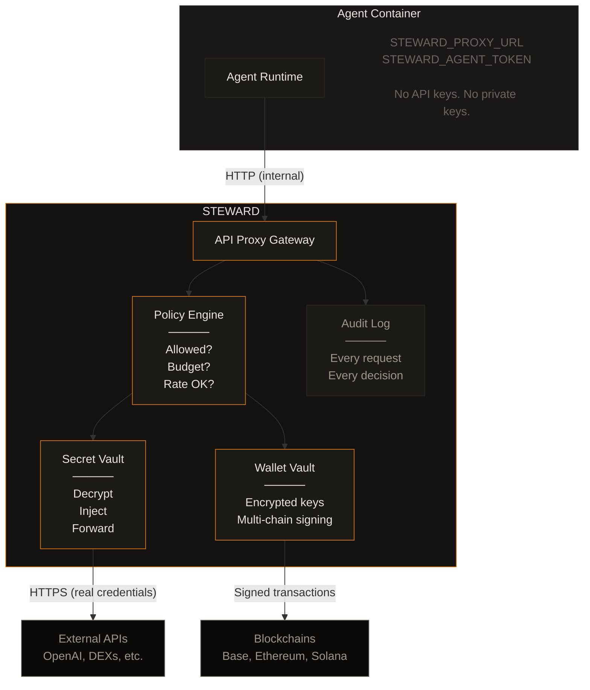
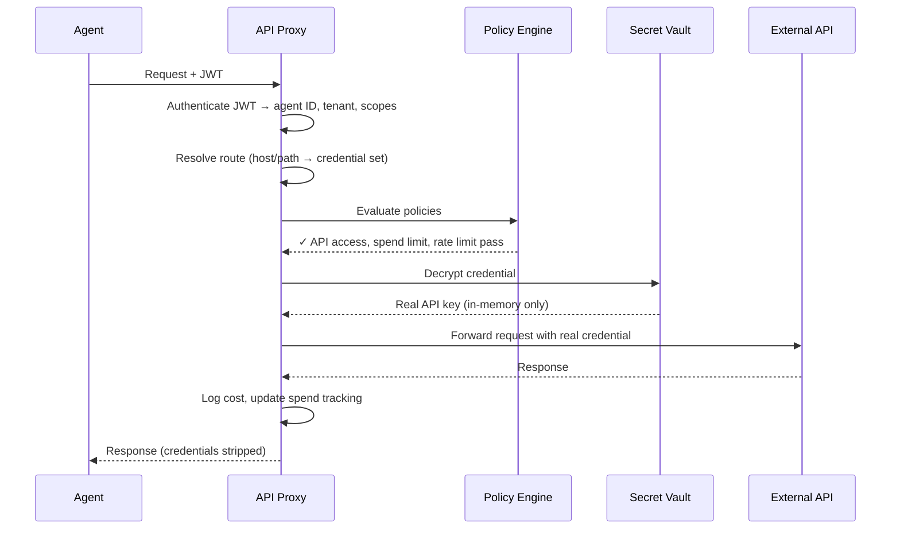
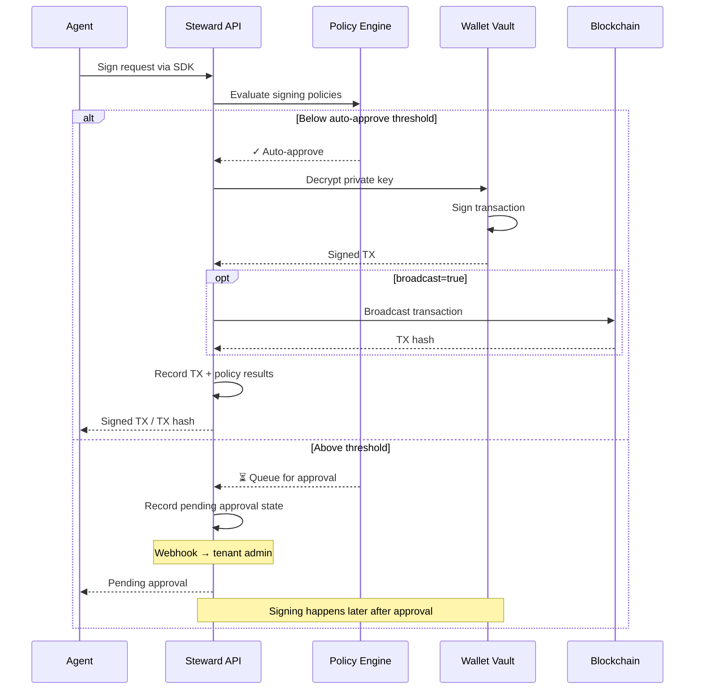
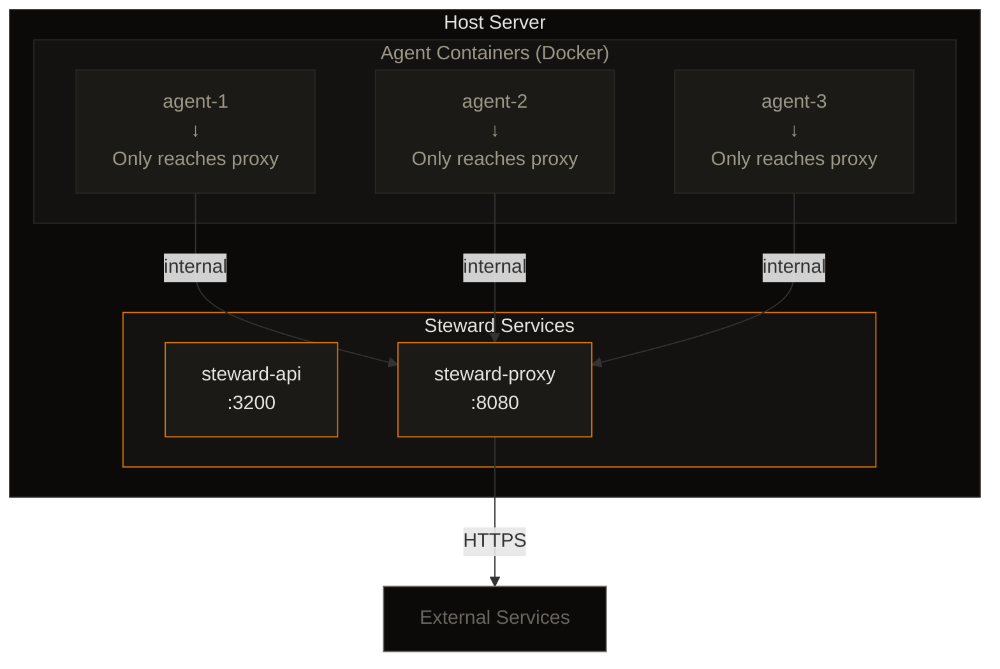
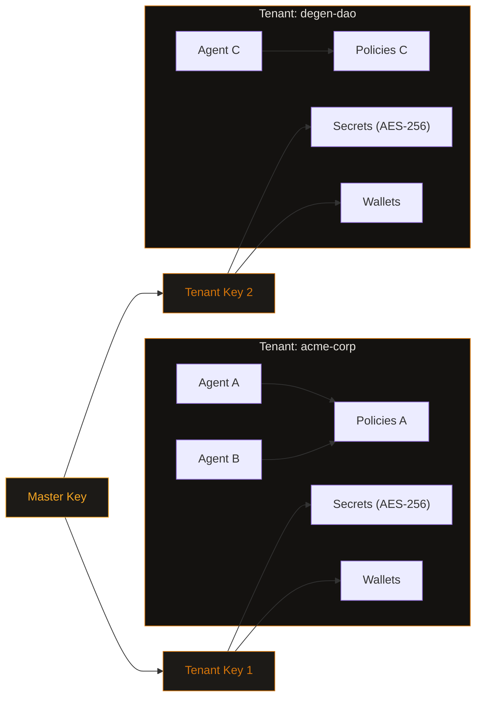

# Architecture

Steward is the single chokepoint between an AI agent and the outside world. Every API call, every transaction, every secret access flows through Steward, gets policy-checked, gets logged, gets metered.

## Three Pillars

<CardGroup cols={3}>
  <Card title="Wallet Vault" icon="vault">
    Encrypted key storage with policy-enforced signing. Agents never see private keys.
  </Card>
  <Card title="Secret Vault" icon="key">
    Encrypted credential storage with an API proxy. Agents never see API keys.
  </Card>
  <Card title="Policy Engine" icon="shield-check">
    Declarative policy evaluation on every action. Default deny.
  </Card>
</CardGroup>

## High-Level Flow

## Request Flow: API Proxy

When an agent makes an API call (e.g., to OpenAI):

## Request Flow: Wallet Signing

When an agent needs to sign a transaction:

## Deployment Topology

<Note>
  Agent containers can be firewalled to **only reach the Steward proxy**. Even if fully compromised, an agent cannot exfiltrate data to arbitrary endpoints.
</Note>

## Multi-Tenant Isolation

Steward is multi-tenant by design:

- **Tenants** are isolated at the database level — each tenant's agents, secrets, and policies are scoped
- **Agents** authenticate with JWTs scoped to their tenant and agent ID
- **Secrets** are encrypted with per-tenant encryption keys (key hierarchy: master → tenant → secret)
- **Policies** are evaluated per-agent within their tenant context

## Tech Stack

| Component | Technology |
|-----------|-----------|
| API Server | [Hono](https://hono.dev) on [Bun](https://bun.sh) |
| Database | PostgreSQL (Neon) |
| Encryption | AES-256-GCM with Argon2id key derivation |
| EVM Signing | [viem](https://viem.sh) |
| Solana Signing | [@solana/web3.js](https://solana-labs.github.io/solana-web3.js/) |
| ORM | [Drizzle](https://orm.drizzle.team) |
| SDK | TypeScript, zero dependencies |
